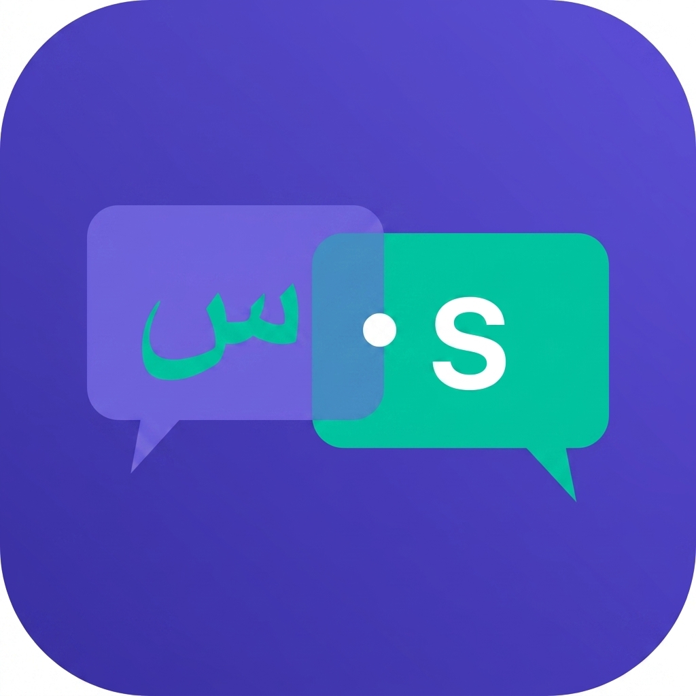

<p align="center">
  
</p>

<h1 align="center">Sawa — سوا</h1>
<p align="center">
  <em>Together, always connected — سوا دايماً متواصلين</em>
</p>

<p align="center">
  
  
  
  
  
</p>

---

## 📱 About

**Sawa (سوا)** is a full-featured Arabic-first calling and chat app, similar to Botim and WhatsApp. Built with Flutter, Firebase, and WebRTC for real-time communication.

### Key Features
- 🔐 **Phone OTP Authentication** — Firebase Auth with Egypt (+20) default
- 💬 **Real-time Chat** — Firestore-powered instant messaging
- 📞 **Voice Calls** — WebRTC peer-to-peer with Socket.IO signaling
- 📹 **Video Calls** — Camera support with flip & toggle
- 📲 **Push Notifications** — FCM for call alerts & messages
- 🔗 **QR Code Discovery** — Scan to add contacts instantly
- 📱 **Native Call UI** — CallKit (iOS) & ConnectionService (Android)

---

## 🎨 Brand Identity

| Element | Value |
|---------|-------|
| Primary | `#5B4FD4` — Deep Purple |
| Accent | `#00C8A0` — Teal |
| Light Purple | `#7B6FE8` |
| Dark Purple | `#3D33A8` |
| Background | `#0D0D1E` |
| Surface | `#22223A` |
| Font | Plus Jakarta Sans |

---

## 🏗 Architecture

**MVVM + Clean Architecture** with strict layer separation:

```
View (Widgets) → ViewModel (Cubit) → Repository → Remote Source → Firebase/API
```

### Tech Stack

| Layer | Technology |
|-------|-----------|
| State Management | `flutter_bloc` (Cubit) |
| Models | `freezed` + `json_serializable` |
| Dependency Injection | `get_it` + `injectable` |
| Navigation | `go_router` |
| Networking | `dio` + `retrofit` |
| Real-time DB | Cloud Firestore |
| Auth | Firebase Phone Auth |
| Signaling | Socket.IO (Node.js server) |
| Media | `flutter_webrtc` |
| Notifications | Firebase Cloud Messaging |

---

## 📂 Project Structure

```
lib/
├── main.dart
├── app/
│   ├── app.dart                         # MaterialApp.router + EasyLoading
│   ├── router/app_router.dart           # GoRouter with auth guards
│   └── theme/
│       ├── app_colors.dart              # Brand color constants
│       └── app_theme.dart               # sawaTheme() with Plus Jakarta Sans
├── core/
│   ├── di/injection.dart                # get_it + injectable setup
│   ├── network/dio_client.dart          # Dio + interceptors
│   ├── webrtc/webrtc_service.dart       # RTCPeerConnection wrapper
│   ├── socket/signaling_service.dart    # Socket.IO client
│   └── utils/                           # Constants, extensions, formatters
├── features/
│   ├── splash/                          # Lottie splash + routing
│   ├── onboarding/                      # 3-page bilingual onboarding
│   ├── auth/                            # Phone OTP login (complete)
│   ├── chat/                            # Chat list + messaging
│   ├── call/                            # Voice & video calls
│   ├── contacts/                        # Contact sync & discovery
│   └── profile/                         # User profile & QR code

signaling_server/
├── server.js                            # Node.js + Express + Socket.IO
└── src/handlers/                        # Call & room event handlers
```

---

## 🚀 Getting Started

### Prerequisites
- Flutter SDK `^3.11.1`
- Node.js `>=18` (for signaling server)
- Firebase project configured
- Physical device recommended (WebRTC requires real hardware)

### Setup

```bash
# 1. Clone the repo
git clone https://github.com/YOUR_USERNAME/webrtc_call_app.git
cd webrtc_call_app

# 2. Install Flutter dependencies
flutter pub get

# 3. Generate code (Freezed, JSON, Injectable)
dart run build_runner build --delete-conflicting-outputs

# 4. Start signaling server (separate terminal)
cd ../signaling_server
npm install
node server.js

# 5. Run the app
flutter run
```

### Environment

| Item | Value |
|------|-------|
| Firebase Project | `webrtc-call-app-5a0db` |
| Android Package | `com.sawa.app` |
| iOS Bundle ID | `com.sawa.app` |
| Signaling Server | `http://<MAC_IP>:3000` |
| Min Android SDK | 23 |
| Min iOS Version | 14.0 |

---

## 📋 Development Roadmap

- [x] **Phase 1–4** — Infrastructure, Firebase, Auth, Home & Chat List
- [x] **Phase 5** — Bug Fixes
- [x] **Phase 6** — Navigation, Branding, Theme, Splash, Onboarding, App Icon
- [x] **Phase 7** — Chat Screen & Real Messaging
- [x] **Phase 8** — QR Code Contact Discovery
- [ ] **Phase 9** — WebRTC Voice Calls
- [ ] **Phase 10** — Video Calls
- [ ] **Phase 11** — Push Notifications (FCM)
- [ ] **Phase 12** — Native Call UI (CallKit / ConnectionService)
- [x] **Phase 13** — Profile & Settings
- [x] **Phase 14** — Last Seen & Status Toggle
- [x] **Phase 17** — Multimedia Chat (Images, Video, Audio, Location, Contacts)
- [ ] **Phase 15** — Contacts Sync
- [ ] **Phase 16** — Production Hardening

See [PROGRESS.md](PROGRESS.md) for detailed session logs and current state.

---

## 🧪 Test Accounts

| Phone | OTP Code |
|-------|----------|
| +20 1125516481 | 123456 |

> Add more test numbers in Firebase Console → Authentication → Phone

---

## 📄 License

Private — All rights reserved.

---

<p align="center">
  <strong>سوا دايماً متواصلين</strong><br/>
  <em>Together, always connected</em>
</p>
